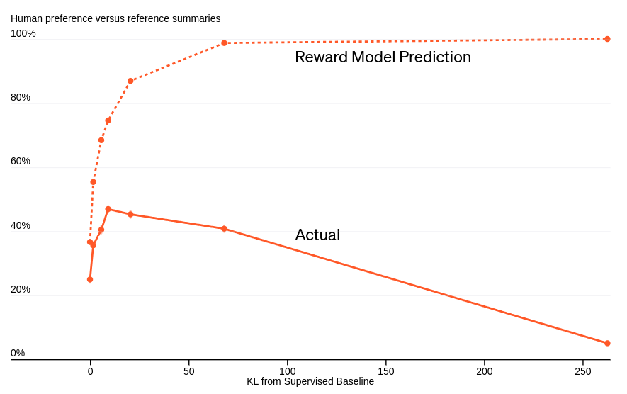

# Learning to Summarize with Human Feedback

**Мы применили обучение с подкреплением на основе человеческого фидбека (RLHF) для обучения языковых моделей, которые лучше справляются с обобщением**.

### **Почему это важно**.

Наши модели генерируют резюме, которые лучше, чем резюме от 10-кратно больших моделей, обученных только с помощью контролируемого обучения. Даже если мы обучаем наши модели на наборе данных Reddit TL;DR, эти же модели генерируют хорошие резюме новостных статей CNN/DailyMail без дополнительной настройки. Наши методы не являются специфическими для составления резюме; в долгосрочной перспективе наша цель — сделать согласование систем ИИ с предпочтениями человека центральным компонентом исследований и внедрения ИИ во многих областях.

**Модели с человеческой обратной связью превосходят гораздо более крупные контролируемые модели и справочные аннотации по TL;DR**

*Рисунок 1. Эффективность различных процедур обучения для моделей разного размера. Эффективность модели измеряется тем, как часто резюме, составленные с помощью этой модели, предпочитаются резюме, написанным человеком. Наши предварительно обученные модели представляют собой ранние версии GPT-3, наши базовые модели с супервизией были точно настроены для предсказания 117 тыс. написанных человеком TL;DR, а наши модели с обратной связью от человека были дополнительно настроены на наборе данных из примерно 65 тыс. сравнений резюме.*

Крупномасштабные языковые модели (Large-scale language models) становятся все более эффективными в задачах NLP. Эти модели обычно обучаются с целью предсказания следующего слова на наборе данных, состоящем из написанного человеком текста. Но эта цель не совсем точно отражает то, что мы хотим получить; обычно мы не хотим, чтобы наши модели имитировали человека, мы хотим, чтобы они давали качественные ответы. Это несоответствие становится очевидным, когда модель обучается имитировать низкокачественный человеческий текст, но оно может проявляться и более тонко. Например, модель, обученная предсказывать, что скажет человек, может выдумывать факты, когда не уверена, или генерировать предложения, отражающие вредную социальную предвзятость - оба варианта отказа хорошо задокументированы. В рамках нашей работы над безопасностью мы хотим это исправить. 

Были использованы две модели: GPT-2 и T5, которые обучали на задаче автоматического резюмирования текста. Затем они предложили людям оценить качество резюме, созданных моделями, и дать обратную связь на основе критериев, таких как полнота, точность и стиль.

После этого исследователи использовали обратную связь, чтобы улучшить работу моделей. Они добавили ее в процесс обучения, используя ее как дополнительную информацию для корректировки весов моделей. В результате модели стали создавать более качественные резюме.

Это исследование показывает, что обратная связь от людей может помочь улучшить работу больших языковых моделей. Это может быть полезно при разработке систем искусственного интеллекта, которые используются в таких областях, как автоматический перевод, генерация текста и анализ данных. Контроль за работой таких систем является важным аспектом разработки, и использование обратной связи от людей может помочь улучшить работу и достигнуть лучших результатов.

## **Результаты переноса**

**Модели человеческой обратной связи, обученные на Reddit, генерируют отличные резюме новостных статей CNN/DM без дополнительного обучения**

Мы проверили свои модели автоматического резюмирования текста на новостных данных CNN/DM и обнаружила, что модели с человеческой обратной связью могут генерировать отличные краткие резюме новостных статей без предварительного обучения. Модель обратной связи с человеком 6,7B генерирует резюме, которые оцениваются выше, чем эталонные резюме CNN/DM, написанные людьми.

**Подход**

Основной метод состоит из четырех этапов: обучение начальной модели обобщения, сбор набора данных, содержащих сравнения обобщений человеком, обучение модели вознаграждения для предсказания предпочтительного для человека обобщения, а затем тонкая настройка наших моделей обобщения с помощью RL для получения высокого вознаграждения.

## **Сбор данных от людей**

Мы обнаружили, что качество обучения моделей прямо зависит от оценок, выставленных маркировщиками. Для улучшения качества данных мы наняли около 80 подрядчиков и разработали процесс найма, интерфейс маркировщика и систему отслеживания качества данных. Это позволило улучшить обучение языковых моделей.

## **Оптимизация модели вознаграждения**

**Оптимизация нашей модели вознаграждения в итоге приводит к ухудшению качества выборки**

*Начиная с базового уровня 1.3B (точка 0 на оси x), мы используем RL для оптимизации политики по отношению к модели вознаграждения, что приводит к политике с различным "расстоянием" от базового уровня (ось x, измеряется с помощью расхождения KL по отношению к базовому уровню). Оптимизация по модели вознаграждения первоначально улучшает итоговые оценки по мнению людей, но в конечном итоге перестраивается, давая худшие итоговые оценки. На этом графике используется более старая версия нашей модели вознаграждения, поэтому пик модели вознаграждения меньше 0,5.*

Мы проверяли, насколько модель вознаграждения может быть улучшена, исследуя, как разные политики оптимизации влияют на оценки, выставленные маркировщиками. Мы обнаружили, что лучшие образцы сводок имеют схожее предсказанное вознаграждение с эталонными резюме. Однако в итоге выяснилось, что оптимизация модели вознаграждения фактически ухудшает ситуацию.

## **Ограничения**

Был применён метод обучения на основе обратной связи с человеком для обучения модели генерации кратких текстов на наборе данных Reddit TL;DR. Этот набор данных содержит сообщения, отправленные пользователями, и, в силу минимальной модерации, некоторые из них могут содержать оскорбительное содержание или отражать социальные предубеждения. Поэтому модели, обученные на этих данных, могут генерировать резюме с предвзятым или оскорбительным содержанием.

Также отмечается, что успешная работа модели требует значительных вычислительных ресурсов: например, настройка модели размером 6,7 ББ с использованием обучения с подкреплением потребовала около 320 GPU-дней. Несмотря на это, исследователи утверждают, что их процедура обучения более экономична и эффективна по сравнению с простым масштабированием моделей для обучения на специфических задачах.

Важно отметить, что хотя модели превзошли человеческие аннотации по некоторым параметрам, они все еще способны генерировать неточные резюме в 45% случаев. В связи с этим исследователи призывают к осторожности в использовании подобных моделей и проведении дальнейших исследований.

## **Будущие направления**

Мы заинтересованы в масштабировании человеческой обратной связи для задач, в которых люди не могут легко оценить качество результатов моделирования. Например, мы хотим, чтобы наши модели отвечали на вопросы, для проверки которых человеку потребовалось бы много исследований; получение достаточного количества человеческих оценок для обучения наших моделей таким образом займет много времени. Один из подходов к решению этой проблемы - дать людям инструменты, которые помогут им оценивать быстрее и точнее. Если эти инструменты используют ML, мы также можем улучшить их с помощью обратной связи с человеком, что позволит людям точно оценивать результаты моделей для все более сложных задач.

Помимо решения более сложных задач, мы также изучаем различные типы обратной связи, помимо бинарных сравнений: мы можем попросить людей предоставить демонстрацию, отредактировать результаты модели, чтобы сделать их лучше, или дать объяснения, почему один результат модели лучше другого. Мы хотим выяснить, какие виды обратной связи наиболее эффективны для обучения моделей, соответствующих предпочтениям человека.
