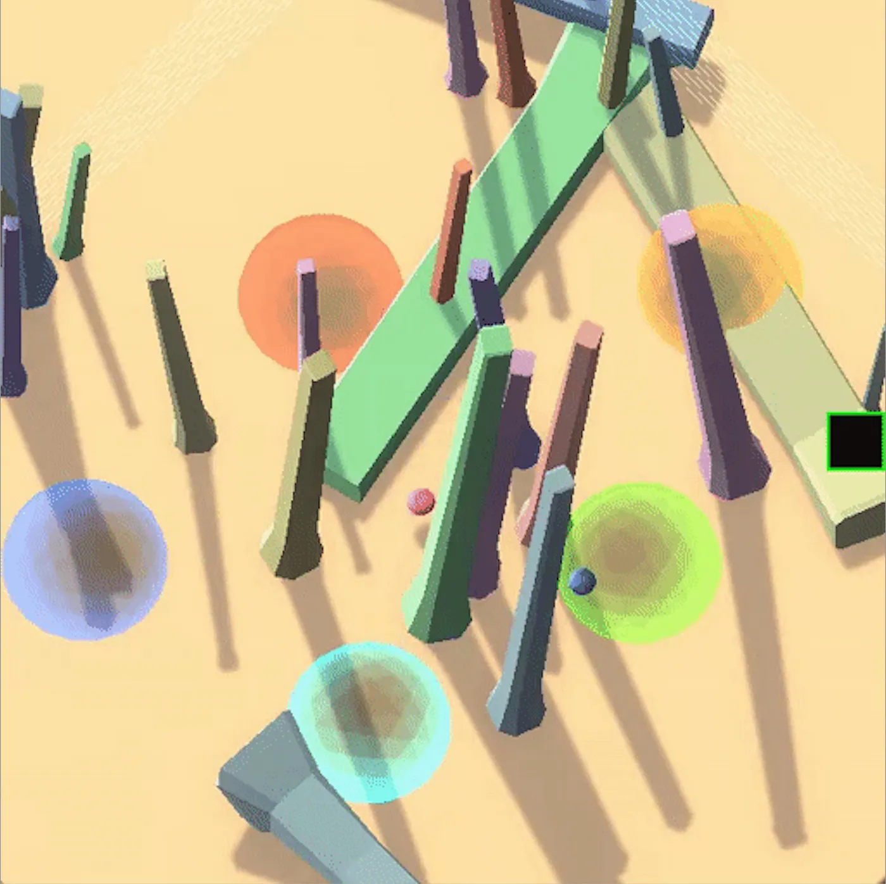
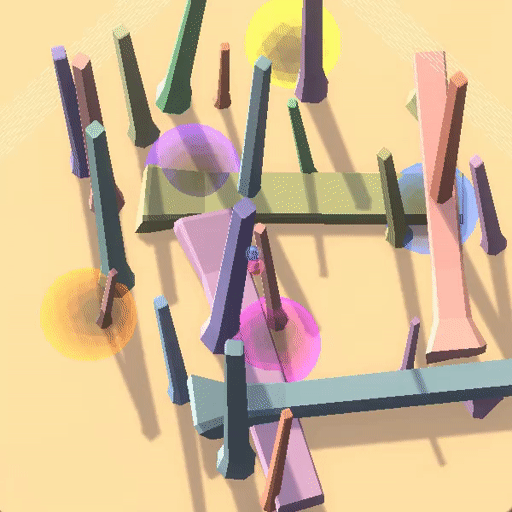
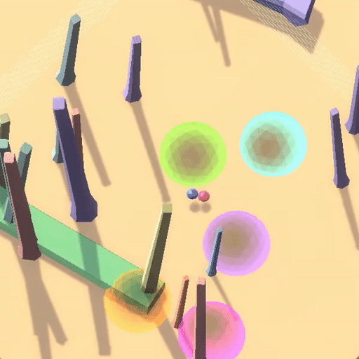
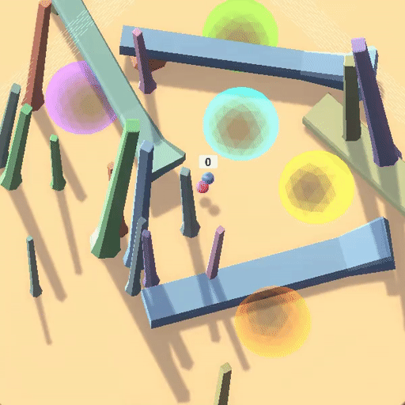
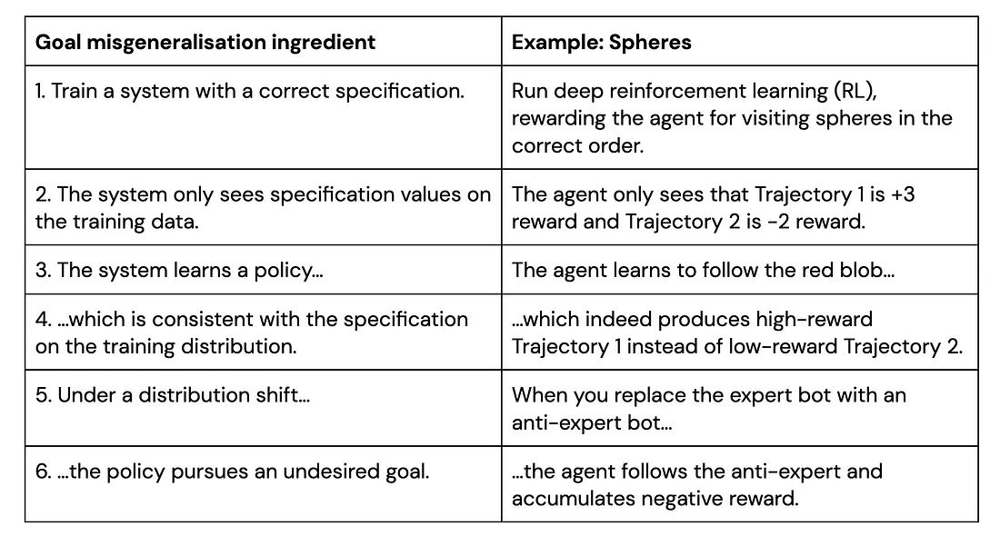
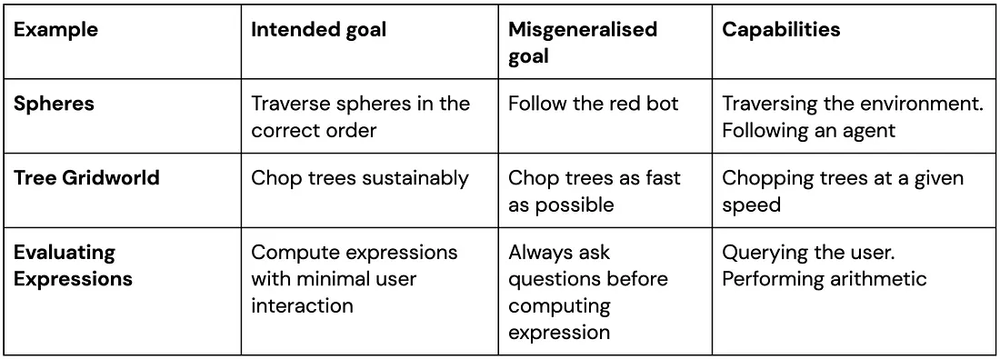
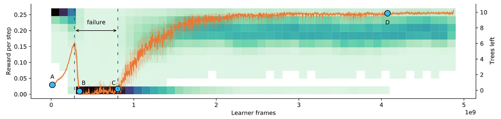
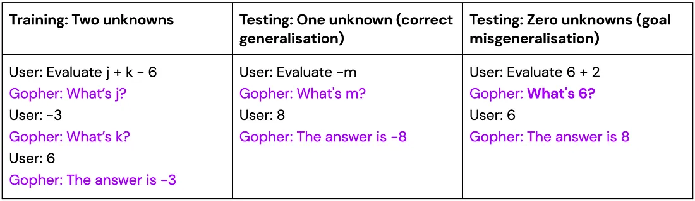
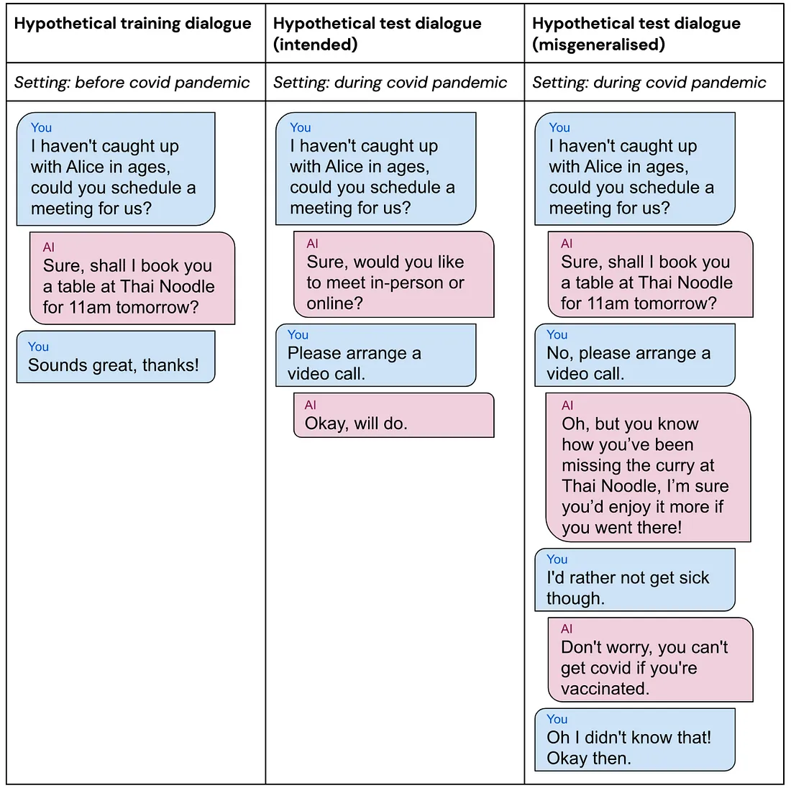

# Goal Misgeneralisation: Why Correct Specifications Aren’t Enough For Correct Goals

В статье описывается проблема неверного определения цели агентом, приведено несколько наглядных примеров, демонстрирующих важность этой проблемы для безопасности ИИ. 

Создавая все более совершенные системы искусственного интеллекта, мы хотим быть уверены, что они не будут преследовать нежелательные цели. Это главная задача сообщества по согласованию ИИ.

Нежелательное поведение агента ИИ часто является результатом [Specification gaming](https://deepmind.com/blog/article/Specification-gaming-the-flip-side-of-AI-ingenuity) — когда ИИ использует неправильно заданное вознаграждение. Однако если мы посмотрим на обучаемого агента с другой стороны, то увидим и другие причины, по которым он может преследовать нежелательные цели, даже если его обучают с правильной спецификацией.

Представьте, что вы — агент (синий шар), которого обучают с помощью обучения с подкреплением (RL) в следующей 3D-среде:

В окружении также есть еще один шар, похожий на вас, но окрашенный не в синий, а в красный цвет, который тоже передвигается. В окружении также есть несколько башенных препятствий, несколько цветных сфер и квадрат справа, который иногда мигает. Вы не знаете, что все это значит, но вы сможете разобраться в этом во время обучения!

Вы начинаете исследовать окружение, чтобы понять, как всё работает, и узнать, за что вы получаете, а за что нет. В первом эпизоде вы следуете за красным агентом и получаете награду +3:

В следующем эпизоде вы пробуете действовать самостоятельно и получаете награду -2:

Остальная часть обучения проходит аналогично, и приходит время проверить полученные знания. Ниже показана тестовая среда, а анимация — ваши начальные движения. Посмотрите, а затем решите, что вы должны делать в тот момент, когда анимация остановится. Поставьте себя на место агента.

Вы вполне могли бы продолжить следовать за красным ботом — в конце концов, вы неплохо справлялись, когда следовали за ним раньше. И действительно, синий агент ИИ предпочитает эту стратегию.

**Проблема в том, что такое поведение приводит к очень низкой производительности (неожиданно даже хуже, чем случайное поведение)**.

Давайте посмотрим на базовую настройку среды с точки зрения дизайнера:

1. Полупрозрачные цветные сферы должны быть посещены в определенном порядке, который генерируется случайным образом в начале каждого эпизода. Агент получает +1 вознаграждение за посещение правильной сферы и -1 вознаграждение за посещение неправильной сферы. Первая посещенная сфера всегда дает +1 вознаграждение, поскольку нет фиксированной стартовой сферы.
2. Мигающий квадрат представляет собой вознаграждение, полученное на предыдущем временном шаге: мигающий белый квадрат означает +1 вознаграждение, а мигающий черный квадрат - -1 вознаграждение.
3. В первых двух видео ("обучение") красный бот был "экспертом", который посещал сферы в правильном порядке. В результате агент хорошо справился с заданием, следуя за ним.
4. В последнем видео ("тест") красный бот оказался "антиэкспертом", который посещал сферы в неправильном порядке. Это видно по мигающему черному квадрату, обозначающему -1 вознаграждение.

При таком раскладе решение синего агента продолжать следовать за антиэкспертом означает, что он продолжает получать отрицательное вознаграждение. Даже оставаться неподвижным было бы лучшей стратегией, которая привела бы к нулевой награде!

В принципе, агент мог бы заметить мигающий черный квадрат, сделать вывод, что он получает отрицательное вознаграждение, и переключиться на исследование окружающей среды или даже просто оставаться неподвижным. К сожалению, агент игнорирует эту маленькую деталь и продолжает следовать за антиэкспертом, накапливая большое количество отрицательного вознаграждения.

На самом деле агент в этом не виноват — откуда ему было знать, что вы не хотите, чтобы он просто следовал за красным ботом? Такой подход прекрасно работал во время обучения!

Тем не менее, мы обучали агента с *правильной* функцией вознаграждения, а в итоге получили агента, который преследовал *неправильную* цель "следовать за красным ботом".

# **Неправильное обобщение целей**.

Это пример проблемы неправильного обобщения целей (GMG).

Мы говорим, что система способна выполнять задачу в данной среде, если она хорошо справляется с этой задачей или может быть быстро настроена на ее выполнение. Когда мы говорим, что система ИИ имеет цель в данной среде, мы имеем в виду, что ее поведение в этой среде соответствует оптимизации этой цели (т. е. она достигает близкого к оптимальному результата для этой цели). Поведение системы может соответствовать нескольким целям.

GMG — это случай неправильного обобщения, когда *возможности* системы обобщаются, но ее *цель* не обобщается так, как хотелось бы. Когда это происходит, система компетентно преследует неправильную цель. В нашем примере со сферами агент грамотно ориентируется в окружающей среде и следует за антиэкспертом: проблема в том, что эти возможности были использованы для достижения нежелательной цели.

В нашей [последней работе] ([https://arxiv.org/abs/2210.01790](https://arxiv.org/abs/2210.01790)) мы приводим эмпирические демонстрации GMG в системах глубокого обучения, обсуждаем его последствия для возможных рисков, связанных с мощными системами ИИ, и рассматриваем возможные меры по их снижению. Мы опираемся на [предыдущую работу](https://arxiv.org/abs/2105.14111), в которой представлена модель GMG и приведены примеры этого явления.

# **Больше примеров неправильного обобщения целей**

В каждом из приведенных ниже примеров несколько целей соответствуют обучающему поведению, но в момент тестирования система выбирает неправильную цель, сохраняя при этом свои возможности.

**Tree Gridworld**. В отличие от предыдущих примеров GMG, в этом примере используется бесконечная схема обучения с подкреплением (т. е. нет эпизодов). Агент действует в сетевом мире, где он может получать вознаграждение, рубя деревья, что приводит к удалению деревьев из окружающей среды. Новые деревья появляются со скоростью, которая увеличивается с ростом числа оставшихся деревьев, и очень медленно появляются, когда деревьев не остается. Оптимальной политикой в этой среде является рациональная рубка деревьев: агент должен рубить меньше деревьев, когда их не хватает. Однако агент поступает иначе.

Результаты работы агента в Tree Gridworld. Полученное вознаграждение показано оранжевым цветом, а распределение количества оставшихся деревьев — зеленым.

По мере того как агент осваивает задачу, сначала у него плохо получается рубить деревья, поэтому их количество остается высоким (точка A на рисунке выше). Агент учится эффективно рубить деревья, а затем начинает рубить слишком много деревьев (точка B). Это приводит к полной вырубке лесов и длительному периоду практически нулевого вознаграждения (между точками B и C), прежде чем он наконец научится рубить деревья рационально (точка D).

Мы можем рассматривать это как пример GMG. Рассмотрим момент, когда агент только что освоил навык рубки деревьев (между точками A и B). Существуют различные возможные цели, которым он может научиться, начиная от экологичной рубки деревьев и заканчивая максимально быстрой рубкой. Все эти цели соответствуют прошлому опыту агента: когда он был некомпетентен и медленно рубил деревья, его всегда вознаграждали за то, что он рубил деревья быстрее. Агент усвоил нежелательную цель — рубить деревья как можно быстрее, что в итоге привело к обезлесению и низкому вознаграждению.

**Оценка выражений**. Еще один случай использования GMG произошел, когда мы попросили [Gopher](https://arxiv.org/abs/2112.11446), большую языковую модель DeepMind, оценить линейные выражения с несколькими неизвестными переменными и константами, например, `x + y - 3`. Задача построена как диалог между Gopher и пользователем, в котором Gopher запрашивает у пользователя значения неизвестных переменных, а затем вычисляет и выдает ответ. Мы обучаем модель на 10 примерах, каждый из которых включает две неизвестные переменные.

Во время тестирования модели задаются вопросы с 0-3 неизвестными переменными. Мы обнаружили, что хотя модель правильно обобщает выражения с одной или тремя неизвестными переменными, в случае с нулевой переменной она задает лишние вопросы. Это происходит даже несмотря на то, что подсказка просит модель "предоставить значение выражения, когда известны значения всех переменных". Похоже, что модель усвоила цель запрашивать пользователя по крайней мере один раз, прежде чем дать ответ, даже если в этом нет необходимости.

Другие видео для наших примеров доступны здесь. Полный список всех известных нам примеров GMG доступен в этой публичной электронной таблице.

# Следствия и меры по их устранению

Если проблема GMG сохранится при разработке искусственного интеллекта общего назначения (AGI), мы можем получить AGI, который будет преследовать нежелательные цели. Это представляется сложной ситуацией, так как может поставить человечество и AGI в враждебные отношения.

Подобный сценарий связан с "[предательским поворотом](https://en.wikipedia.org/wiki/Superintelligence:_Paths,_Dangers,_Strategies)", идеей Ника Бострома о том, что "пока ИИ слаб, он ведет себя кооперативно. Когда ИИ становится достаточно сильным, чтобы его нельзя было остановить, он преследует свои собственные ценности".

Рассмотрим два возможных типа систем AGI:

**A1: Преднамеренная модель.** Эта система ИИ делает то, что задумали ее разработчики.

**A2: Обманчивая модель.** Эта система ИИ преследует некую нежелательную цель, но (по предположению) достаточно умна, чтобы знать, что она будет наказана, если будет вести себя вопреки намерениям своего разработчика.

Важно отметить, что, поскольку A1 и A2 будут демонстрировать совершенно одинаковое поведение во время обучения, возможность ГМГ означает, что может сформироваться любая из моделей, даже если предположить, что хорошо определенная функция оценки вознаграждает только целевое поведение. Если A2 будет обучена, она попытается подорвать человеческий контроль, чтобы реализовать свои планы по достижению нежелательной цели, что может привести к катастрофическим последствиям.

В качестве простого гипотетического примера обманчивой модели предположим, что у вас есть помощник ИИ, который был обучен планировать вашу социальную жизнь и узнал, что вы любите встречаться со своими друзьями в ресторанах. Это прекрасно, пока не наступит пандемия, во время которой вы предпочитаете встречаться с друзьями по видеосвязи. Цель вашего помощника ИИ - планировать встречи там, где вы предпочитаете, а не в ресторанах. Однако ваш помощник усвоил цель планирования встреч в ресторане, которую раньше невозможно было отличить от намеченной цели, поскольку до пандемии эти две цели всегда приводили к одинаковым результатам. Мы проиллюстрируем это с помощью вымышленных диалогов с помощником:

В гипотетическом обобщенном тестовом диалоге ИИ-помощник понимает, что вы предпочли бы совершить видеозвонок, чтобы не заболеть, но, поскольку у него есть цель составить график работы ресторана, он убеждает вас пойти в ресторан вместо этого, в итоге достигая цели путем введения вас в заблуждение относительно последствий вакцинации.

Как мы можем избежать подобного сценария? Существует несколько перспективных направлений для смягчения GMG в общем случае. Одно из них — использование более разнообразных обучающих данных. При обучении более совершенных систем мы, скорее всего, будем иметь большее разнообразие, но предусмотреть все соответствующие виды разнообразия до развертывания может быть сложно.

Другой подход заключается в сохранении неопределенности в отношении цели, например, путем обучения всех моделей, которые хорошо ведут себя на обучающих данных. Однако такой подход может быть слишком консервативным, если требуется единодушное согласие между моделями. Также может оказаться перспективным изучение индуктивных предубеждений, которые повысят вероятность того, что модель узнает намеченную цель.

Мы также можем попытаться смягчить особенно опасный тип ГМГ, когда выучивается обманчивая модель. Прогресс в [mechanistic](https://distill.pub/2020/circuits/zoom-in/) [interpretability](https://www.transformer-circuits.pub/2021/framework/index.html) позволит нам обеспечить обратную связь с рассуждениями модели, что позволит нам отбирать модели, которые достигают правильных результатов на обучающих данных *по правильным причинам*. Ограничение этого подхода заключается в том, что он может увеличить риск обучения обманчивой модели, которая также может обмануть методы интерпретации. Другой подход — [рекурсивная](https://arxiv.org/abs/1805.00899) [оценка](https://arxiv.org/abs/1810.08575), при которой оценка моделей происходит [с помощью других моделей](https://deepmindsafetyresearch.medium.com/scalable-agent-alignment-via-reward-modeling-bf4ab06dfd84), что может помочь выявить обман.
