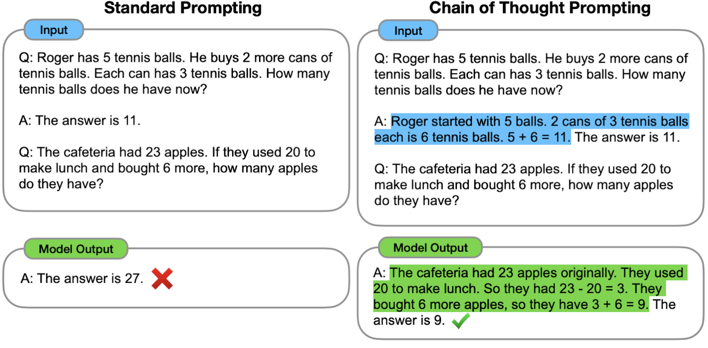
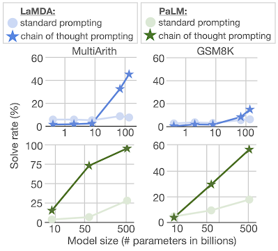
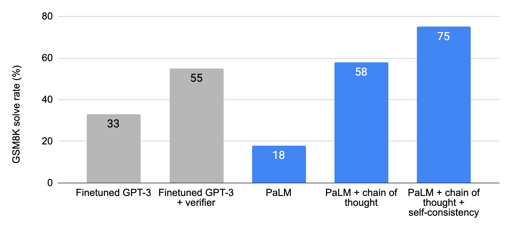
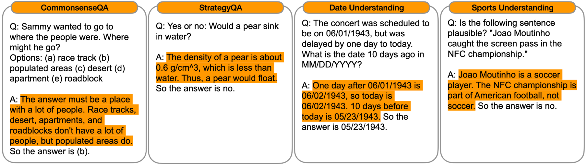
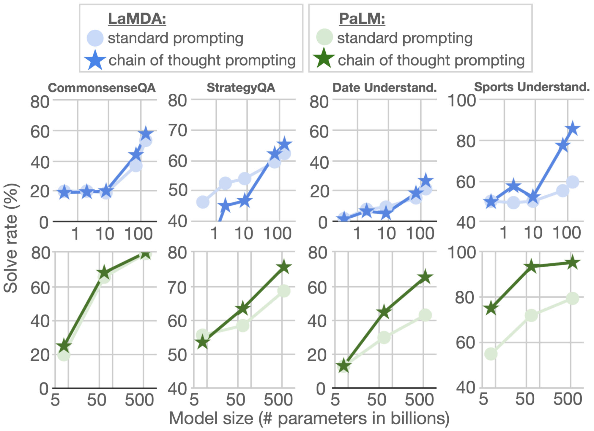

# Language Models Perform Reasoning via Chain of Thought

В последние годы было показано, что увеличение размера языковых моделей является эффективным способом повышения производительности при выполнении целого ряда задач обработки естественного языка (NLP). Современные языковые модели с параметрами масштаба 100B и более обеспечивают высокую производительность в таких задачах, как анализ настроения и машинный перевод, даже при небольшом количестве обучающих примеров или вообще без них. Однако даже самые крупные языковые модели по-прежнему могут испытывать трудности с многоэтапными “задачами рассуждения”: например, задачи с математическими терминами и рассуждения на основе здравого смысла. Как мы могли бы позволить языковым моделям выполнять такие “задачи рассуждения”?

В статье “Подсказка по цепочке мыслей вызывает рассуждения в больших языковых моделях” мы исследуем метод подсказки для улучшения логических способностей языковых моделей. Этот метод, называемый подсказкой по цепочке мыслей, позволяет моделям разбивать многоступенчатые задачи на промежуточные этапы. С помощью подсказки цепочки мыслей языковые модели достаточного масштаба (~100B параметров) могут решать сложные логические задачи, которые не решаются стандартными методами подсказки.

## Сравнение со стандартными подсказками

С помощью стандартного запроса (популяризированного GPT-3) модели даются примеры пар ввода–вывода (в формате вопросов и ответов), прежде чем ее попросят предсказать ответ для примера во время тестирования (показано ниже слева). В подсказке цепочки мыслей (ниже, справа) модели предлагается выполнить промежуточные шаги рассуждения, прежде чем дать окончательный ответ на многоступенчатую задачу. Идея заключается в том, что сгенерированная моделью цепочка мыслей будет имитировать интуитивный мыслительный процесс при работе с многоступенчатой “задачей рассуждения”. Хотя создание мыслительного процесса ранее осуществлялось с помощью тонкой настройки, мы показываем, что такие мыслительные процессы можно выявить, включив несколько примеров цепочки мыслей только с помощью подсказок, что не требует большого набора обучающих данных или изменения весовых коэффициентов языковой модели.

*В то время как стандартная подсказка требует от модели прямого ответа на многошаговую задачу, подсказка в виде цепочки мыслей побуждает модель разложить задачу на промежуточные шаги рассуждения, в данном случае приводящие к правильному окончательному ответу.*

Цепочка рассуждений позволяет моделям разложить сложные задачи на промежуточные этапы, которые решаются по отдельности. Более того, языковая природа цепного мышления делает его применимым к любой задаче, которую человек может решить с помощью языка. В ходе эмпирических экспериментов мы обнаружили, что подсказки в виде цепочки мыслей могут улучшить производительность в различных задачах на рассуждение, и что успешное рассуждение в виде цепочки мыслей является эмерджентным свойством масштаба модели - то есть преимущества подсказок в виде цепочки мыслей материализуются только при достаточном количестве параметров модели (около 100B).

## Арифметические рассуждения

Один из классов задач, в которых языковые модели обычно испытывают трудности, — это арифметические рассуждения (т. е. решение математических задач). Двумя эталонами арифметических рассуждений являются **[MultiArith](https://aclanthology.org/D15-1202/)** и **[GSM8K](https://arxiv.org/abs/2110.14168)**, которые проверяют способность языковых моделей решать многоэтапные математические задачи, подобные той, что показана на рисунке выше. Мы оцениваем как **[коллекцию LaMDA](https://ai.googleblog.com/2022/01/lamda-towards-safe-grounded-and-high.html)** языковых моделей с параметрами от 422M до 137B, так и **[коллекцию PaLM](https://ai.googleblog.com/2022/04/pathways-language-model-palm-scaling-to.html)** языковых моделей с параметрами от 8B до 540B. Мы вручную составляем цепочки мыслей, чтобы включить их в примеры для подсказки цепочек мыслей.

Для этих двух бенчмарков использование стандартных подсказок приводит к относительно плоским кривым масштабирования: увеличение масштаба модели не приводит к существенному улучшению производительности (показано ниже). Однако мы обнаружили, что при использовании подсказки в виде цепочки мыслей увеличение масштаба модели приводит к улучшению производительности, которая значительно превосходит стандартную подсказку при больших размерах модели.

*Использование подсказок в виде цепочки мыслей позволяет языковым моделям решать арифметические задачи на рассуждение, для которых стандартные подсказки имеют в основном плоскую кривую масштабирования.*

На наборе данных GSM8K, состоящем из математических словесных задач, PaLM демонстрирует замечательную производительность при масштабировании до 540B параметров. Как показано в приведенной ниже таблице, сочетание цепочки мыслей с моделью PaLM с параметрами 540B приводит к новой современной производительности в 58%, превосходящей предыдущий уровень техники в 55%, достигнутый путем точной настройки GPT-3 175B на большой обучающей выборке и последующего ранжирования потенциальных решений с помощью специально обученного верификатора. Более того, последующая работа над самосогласованностью показывает, что эффективность подсказки цепочки мыслей может быть улучшена еще больше путем принятия большинства голосов широкого набора сгенерированных процессов рассуждения, что приводит к 74 % точности на GSM8K.

*Цепочка подсказок с помощью PaLM достигает нового уровня техники на эталоне GSM8K, состоящем из математических словесных задач. Для корректного сравнения с базовыми показателями GPT-3, результаты, полученные с помощью цепочки мыслей, также используют внешний калькулятор для вычисления основных арифметических функций (сложение, вычитание, умножение и деление).*

## Рассуждения на основе здравого смысла

В дополнение к арифметическим рассуждениям мы рассмотрим, позволяет ли языковая природа подсказки цепочки мыслей применить ее к рассуждениям на основе здравого смысла, которые предполагают рассуждения о физических и человеческих взаимодействиях при наличии общих знаний. Для этих оценок мы используем эталоны **[CommonsenseQA](https://aclanthology.org/N19-1421)** и **[StrategyQA](https://aclanthology.org/2021.tacl-1.21)**, а также две специфические задачи из **[BIG-Bench collaboration](https://github.com/google/BIG-bench/)**, касающиеся **[понимания даты](https://github.com/google/BIG-bench/tree/main/bigbench/benchmark_tasks/date_understanding)** и **[понимания спорта](https://github.com/google/BIG-bench/tree/main/bigbench/benchmark_tasks/sports_understanding)**. Примеры вопросов приведены ниже:

Как показано ниже, для CommonsenseQA, StrategyQA и Date Understanding показатели улучшились с масштабированием модели, а использование цепочки мыслей привело к дополнительным небольшим улучшениям. Наибольшее улучшение с помощью цепочки мыслей было достигнуто в понимании спорта, где показатели цепочки мыслей у PaLM 540B превзошли показатели любителя спорта без посторонней помощи (95 % против 84 %).

*Подсказки в виде цепочки мыслей также улучшают результаты выполнения различных типов заданий на логическое мышление.*

## Выводы

Цепочка мыслеобразов — простой и широко применимый метод улучшения способности языковых моделей выполнять различные задачи рассуждения. Проведя эксперименты с арифметическими и логическими рассуждениями, мы обнаружили, что многоступенчатое побуждение размышлению является эмерджентным свойством масштаба модели. Расширение спектра задач, которые могут решать языковые модели, надеюсь, внесёт вклад в дальнейшую работу над языковыми подходами к рассуждениям.
