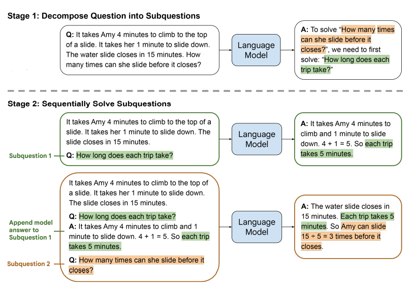
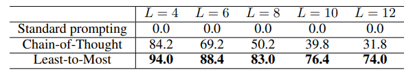

# Least-to-Most Prompting Enables Complex Reasoning in Large Language Models

# Аннотация

Метод от наименьшей к наибольшей подсказке является новой стратегией для задач естественного языка (NLP), которая разбивает сложные проблемы на более простые подзадачи и последовательно решает их. Он превосходит стратегию цепочки мыслей при выполнении задач, требующих решения более сложных проблем, чем те, которые встречаются в подсказках. Экспериментальные результаты демонстрируют способность к обобщению на более сложные проблемы. Модель GPT-3 с кодом davinci-002, использующая метод от наименьшей к наибольшей подсказке, может решать композиционный бенчмарк SCAN с точностью не менее 99% всего лишь с 14 примерами, в то время как точность при использовании стратегии цепочки мыслей составляет всего 16%.

# 1 ВВЕДЕНИЕ

**Подзадачи.** Оба этапа реализуются с помощью подсказок few-shot, чтобы не было никакого обучения или тонкой настройки на любом этапе. Пример использования подсказки "от меньшего к большему" далее показан на рисунке 1.
Термин "подсказка от наименьшего к наибольшему" заимствован из психологии образования (Libby et al., 2008), где он используется для обозначения техники использования прогрессивной последовательности подсказок, чтобы помочь ученику освоить новый навык. Здесь мы применяем эту технику для обучения людей языковым моделям. Эмпирические результаты в области символьных манипуляций, композиционного обобщения и математических рассуждений показывают, что подсказки по принципу "от меньшего к большему" действительно могут распространяться на задачи сложнее тех, которые были продемонстрированы.

Рисунок 1. Решение математической задачи в два этапа: (1) запрос к языковой модели для декомпозиции задачи на подзадачи; (2) запрос к языковой модели для последовательного решения подзадач. Ответ на вторую подзадачу строится на основе ответа на первую подзадачу. Демонстрационные примеры для подсказок каждого этапа в данной иллюстрации опущены

# 2 LEAST-TO-MOST PROMPTING

Подсказки "от меньшего к большему" учат языковые модели решать сложную задачу путем разложения ее на ряд более простых подзадач. Она состоит из двух последовательных этапов:

1. Декомпозиция. Подсказка на этом этапе содержит константные примеры, демонстрирующие декомпозиции, а затем конкретный вопрос, который необходимо декомпозировать.
2. Решение подзадач. Подсказка на этом этапе состоит из трех частей: 

(1) константные примеры, демонстрирующие решение подзадач;
(2) потенциально пустой список ранее отвеченных подвопросов и сгенерированных решений, (3) вопрос, на который нужно ответить в следующий раз.
В примере, показанном на рисунке 1, языковой модели сначала предлагается декомпозировать исходную задачу на подзадачи. 

Подсказка, передаваемая модели, состоит из примеров, иллюстрирующих как декомпозировать сложные задачи (которые не показаны на рисунке), а затем конкретную задачу, которую нужно декомпозировать (как показано на рисунке). Языковая модель показывает, что исходная задача может быть решена через решение промежуточной задачи "Сколько времени занимает каждая поездка?".

На следующем этапе мы просим языковую модель последовательно решить подзадачи, полученные на этапе декомпозиции задачи. Исходная задача добавляется в качестве конечной подзадачи. 

Решение начинается с передачи языковой модели подсказки, состоящей из примеров, иллюстрирующих, как решаются задачи (на рисунке не показано), затем следует первая подзадача "Сколько времени занимает каждая поездка?". Затем мы берем ответ, сгенерированный языковой моделью ("...каждая поездка занимает 5 минут"), и строим следующую подсказку, добавляя сгенерированный ответ к предыдущей подсказке, а затем следующую подпроблему, которая в данном примере является исходной проблемой. Затем новая подсказка передается обратно в языковую модель, которая возвращает окончательный ответ. Подсказки "от меньшего к большему" можно комбинировать с другими техниками подсказок, такими как "chain-of-thought" (Wei et al., 2022) и "self-consistency" (Wang et al., 2022b), но не обязательно. Кроме того, для некоторых задач два этапа подсказки "от меньшего к большему" могут быть объединены в одну подсказку.

# 3 РЕЗУЛЬТАТЫ

Мы представляем результаты использования подсказок "от наименьшего к наибольшему" для заданий на символическое манипулирование, композиционное обобщение и математические рассуждения, а также сравниваем их с подсказками "по цепочке мыслей" (chain-of-thought).

## 3.1 СИМВОЛИЧЕСКОЕ МАНИПУЛИРОВАНИЕ

Возьмем задачу "Конкатенация последней буквы" (Wei et al., 2022). В этой задаче каждый вход представляет собой список слов, а соответствующий выход — конкатенация последних букв слов в списке. Например, "мышление, машина" выводит "ge", поскольку последняя буква слова "мышление" — "g", а последняя буква слова "машина" — "e".

Подсказки по цепочке мыслей отлично работают, когда проверочные списки имеют ту же длину, что и списки в примерах подсказок. Однако она плохо работает, когда тестирующие списки намного длиннее списков в примерах подсказок. Мы показываем, что подсказка “от меньшего к большему” преодолевает это ограничение и значительно превосходят подсказки по цепочке мыслей при обобщении длины.

Q: “think, machine, learning”
A: “think”, “think, machine”, “think, machine, learning”
Table 1: Least-to-most prompt context (decomposition) for the last-letter-concatenation task. It can
decompose arbitrary long lists into sequential subsists with an accuracy of 100%.
Q: “think, machine”
A: The last letter of “think” is “k”. The last letter of “machine” is “e”. Concatenating “k”, “e” leads
to “ke”. So, “think, machine” outputs “ke”.
Q: “think, machine, learning”
A: “think, machine” outputs “ke”. The last letter of “learning” is “g”. Concatenating “ke”, “g”
leads to “keg”. So, “think, machine, learning” outputs “keg”.

Таблица 2. Контекст запроса (решение) от наименьшего к наибольшему для задачи объединения последних букв. Два примера в этом приглашении фактически демонстрируют базовый вариант и рекурсивный шаг.

**Наименьшее количество подсказок.** Наименьшее количество контекстов подсказок для задачи "Конкатенация последней буквы” представлены в таблицах 1 и 2. Пример в Таблице 1 демонстрирует, как разложить список на последовательность подсписков. Пример в таблице 2 демонстрирует, как сопоставить входные данные с желаемыми выходными данными. 

Получив новый список, мы сначала добавляем его к примеру в таблице 1, чтобы создать подсказку о декомпозиции, которая отправляется в языковую модель для получения декомпозиции списка.

Затем для каждого подсписка S мы строим подсказку решения, которая состоит из примеров в таблице 2, затем предыдущих пар подсписок/ответ (если они есть), а затем S. 

Мы последовательно выдаем эти подсказки языковой модели и используем последний ответ в качестве окончательного решения.
Стоит внимательнее присмотреться к примерам в таблице 2. По сути, они учат языковые модели тому, как строить ответы на новые задачи, используя ответы на ранее решенные задачи: (1) список во втором примере ("think, machine, learning") является продолжением списка в первом примере ("think, machine"), а не полностью независимым; (2) ответ на вопрос "think, machine, learning" строится на основе вывода "think, machine", начиная с предложения о том, что "think, machine" выводит "ke".

Эти два примера вместе иллюстрируют базовый случай и рекурсивный шаг. 

**Подсказки для цепочки размышлений.** Контекст цепной подсказки для задачи конкатенации последних букв приведен в таблице 3. В нем используются те же списки, что и в подсказке "от меньшего к большему" в таблице 2. Единственное отличие заключается в том, что в этой цепочке подсказок ответ на второй список ("think, machine, learning") строится с нуля, а не используется результат первого списка ("think, machine").

Q: “think, machine”
A: The last letter of “think” is “k”. The last letter of “machine” is “e”. Concatenating “k”, “e” leads
to “ke”. So, “think, machine” outputs “ke”.
Q: “think, machine, learning”
A: The last letter of “think” is “k”. The last letter of “machine” is “e”. The last letter of “learning”
is “g”. Concatenating “k”, “e”, “g” leads to “keg”. So, “think, machine, learning” outputs “keg”.

Получив новый список, мы сначала добавляем его к примеру в таблице 1, чтобы создать подсказку о декомпозиции, которая отправляется в языковую модель для получения декомпозиции списка.

Мы сравниваем подсказку "от наименьшего к наибольшему" (табл. 1 и 2) с подсказкой chain-of-thought (табл. 3) и стандартной подсказкой few-shot. Подсказка для стандартной подсказки в несколько кадров строится путем удаления промежуточных объяснений в подсказке цепочки мыслей. То есть она состоит только из этих двух примеров: (1) "think, machine" выводит "ke"; и (2) "think, machine, learning" выводит "keg". Мы не рассматриваем базовый уровень обучения или тонкой настройки, поскольку модель машинного обучения, основанная на двух примерах, будет очень плохо обобщать.

**Результаты.** Мы произвольно выбираем слова из Викисловаря-1 для построения тестовых списков, длина которых варьируется от 4 до 12. Для каждой заданной длины было построено 500 списков. Точность различных методов с кодом davinci-002 в GPT-3 приведены в таблице 4. Стандартные подсказки полностью проваливают все тестовые случаи с точностью до 0. Цепная подсказка значительно повышает производительность по сравнению со стандартной подсказкой, но она все равно сильно отстает от подсказки "от наименьшего к наибольшему", особенно когда списки длинные. Более того, с увеличением длины списков производительность цепочки подсказок падает гораздо быстрее, чем у подсказки "от наименьшего к наибольшему".

Таблица 4: Точность различных методов подсказки при выполнении последней задачи по объединению букв. Длина списков тестирования увеличивается с 4 до 12.

В Приложениях 7.2 и 7.3 представлены дополнительные эксперименты с различными chain-of-thought подсказками и различными языковыми моделями. Обратите внимание, что, в отличие от подсказки "от меньшего к большему", примеры в цепочке подсказок могут быть независимыми друг от друга. Для задачи конкатенации последних букв это означает, что нам не нужно представлять примеры, которые являются подсписками других примеров. На самом деле, цепочка размышлений с независимыми списками, как правило, превосходит цепочку с зависимыми списками, поскольку первая передает больше информации. Более того, мы можем усилить цепочку мыслей, включив в нее дополнительные примеры. Это кажется справедливым, так как подсказка "от наименьшего к наибольшему" содержит больше слов за счет дополнительной декомпозиции. Как показано в таблице 13 (Приложение 7.3), для списков длиной 12 цепочка подсказок достигает точности 37,4% с 4 независимыми примерами (Приложение 7.2.2) и 38,4% с 8 независимыми примерами (Приложение 7.2.3). Несмотря на заметный прогресс по сравнению с точностью 31,8 % в оригинальной подсказке в Таблице 3, подсказка по цепочке мыслей все еще отстает от подсказки "от меньшего к большему", которая может похвастаться точностью 74,0 %.

**Анализ ошибок.** Хотя подсказка "от меньшего к большему" значительно превосходит подсказку chain-of-thought, она все еще далека от 100 % точности для длинных списков. В Приложении 7.4 мы приводим подробный анализ ошибок. Мы обнаружили, что лишь очень немногие из них связаны с неправильными последними буквами, в то время как большинство из них — это ошибки конкатенации (опущение или добавление буквы). Например, в списке "gratified, contract, fortitude, blew", модель опускает последнюю букву в конкатенации "dte" и "w", и таким образом, предсказывает, что результатом будет "dte", а не "dtew". В другом примере "hollow, supplies, function, gorgeous" модель каким-то образом дублирует последнюю букву "s" в конкатенации "wsn" и "s", и таким образом предсказание становится "wsnss" вместо "wsns".
