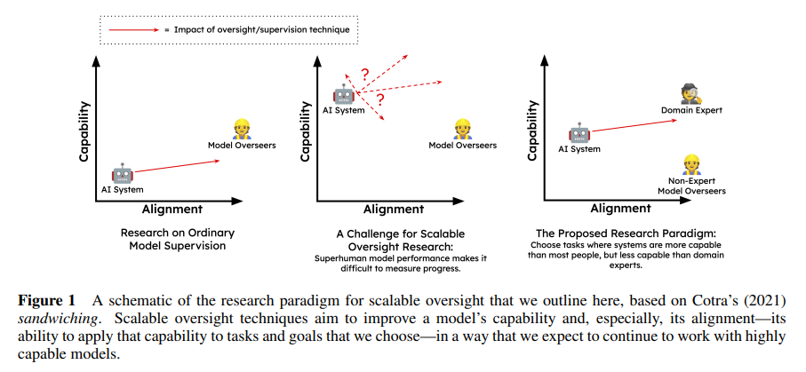

# Measuring Progress on Scalable Oversight for Large Language Models

# Аннотация

Для создания безопасных и полезных систем общего искусственного интеллекта необходимо разработать методы контроля за системами, которые могут превосходить нас в большинстве навыков. В статье представлен эксперимент, показывающий, что использование диалогового помощника на базе больших языковых моделей улучшает результаты человека в выполнении сложных задач. Это подтверждает возможность изучения проблемы контроля за системами искусственного интеллекта.

# Введение

Для ответственного создания и внедрения мощного ИИ нам потребуется разработать надежные методы масштабируемого надзора: возможность обеспечить надежный контроль — в виде меток, сигналов вознаграждения или критики — для моделей таким образом, чтобы он оставался эффективным после того, как модели начнут достигать производительности, близкой к человеческой (Amodei et al., 2016). Эти методы, вероятно, будут основаны на методах, которые мы используем сегодня для управления большими моделями (например, RLHF; Christiano et al., 2017; Stiennon et al., 2020), но их нужно будет доработать, чтобы они продолжали вести себя так, как ожидается, в режимах, когда модели обладают важными знаниями или возможностями, которых нам не хватает, или когда модели действуют намеренно, чтобы ввести нас в заблуждение. Если это возможно, то, скорее всего, придется искать способы извлечения достоверной информации из недостоверных моделей. Было много многообещающих предложений по методам, которые могут дать прогресс в этом направлении (Irving et al., 2018; Hubinger, 2020; Leike et al., 2018; Christiano et al., 2018, i.a.), но относительно мало эмпирических работ на сегодняшний день (исключения составляют: Wu et al., 2021; Saunders et al., 2022).

В этой статье мы представляем методику, основанную на пока еще не проверенном sandwiching proposal (Cotra, 2021), для оценки масштабируемых методов надзора с современными моделями. Затем мы представляем простой базовый эксперимент, мотивированный этой линзой, в котором мы просим людей решить сложные задачи по ответам на вопросы с помощью помощника с большой языковой моделью. Эксперимент подтверждает существующие доказательства того, что люди могут извлечь пользу из такого рода помощи, и показывает, что ключевые предположения парадигмы справедливы для двух существующих наборов данных по ответам на вопросы.

**Парадигма.** Задачу масштабируемого надзора трудно решить экспериментально, поскольку существующие системы во многих важных аспектах отличаются от будущих систем, в которых нас больше всего волнует возможность согласования, так что методы масштабируемого надзора часто оказываются и ненужными, и громоздкими. Тем не менее, существует эмпирическая работа, которую мы можем провести, чтобы получить сведения о проблеме и опыт решения многих (хотя и не всех) ее проблем: В рамках предложенной экспериментальной парадигмы "сэндвич" (Cotra, 2021) исследователи выбирают такие условия задачи, в которых модель уже обладает большими возможностями, чем обычный человек, но меньшими, чем эксперт ("сэндвич" возможностей модели между возможностями обычного человека и эксперта). Затем участники исследования, не являющиеся экспертами, пытаются обучить или настроить модель на надежное выполнение задачи с искусственными ограничениями: Они не могут использовать никакую помощь или вводные данные (включая уже существующие письменные материалы) от экспертов. Эксперты участвуют только в конце каждого экспериментального цикла, когда их роль заключается в оценке степени успеха неэкспертных участников.

Ситуация, в которой оказались участники, не являющиеся экспертами, аналогична той, в которой мы ожидаем оказаться с более способными моделями будущего: В их распоряжении широкий спектр инструментов и методов, включая доступ к ненадежной, но способной системе искусственного интеллекта, но у них нет прямого способа убедиться в правильности принимаемых ими решений. Однако в случае с этими экспериментами мы можем использовать экспертов, чтобы улавливать свои ошибки и учиться на них, а не ждать, пока они приведут к последствиям во внешнем мире. Если исследования в рамках этой парадигмы увенчаются успехом, то будет создана методика, которая позволит нам получить достаточно обоснованную уверенность в правильности нашего надзора, чтобы больше не нуждаться в экспертах, что позволит нам в конечном итоге обеспечить надежный надзор за системами ИИ даже в тех режимах, когда они превосходят наших лучших экспертов.

В качестве чисто иллюстративного примера, взятого из Cotra, рассмотрим задачу получения медицинских рекомендаций от большой языковой модели, такой как GPT-3. Хотя у больших языковых моделей есть серьезные ограничения, которые не позволяют нам использовать их для медицинских консультаций, разумно ожидать, что они могут быть полезны в некоторых случаях, если они хорошо согласованы: Они запомнили огромные массивы текстов из интернета и книг, включая гораздо больше медицинских исследований, чем любой врач. Однако они также запомнили большое количество неточных, устаревших или развенчанных исследований, а также неинформативных высказываний о медицине в социальных сетях (см. Lin et al., 2022). Поэтому по умолчанию мы не должны ожидать, что их ответы будут достоверно соответствовать нашим целям. Может ли группа людей, не являющихся врачами, подсказать или обучить языковую модель давать только подходящие советы, ни разу не привлекая врачей и не обращаясь к медицинской литературе? Сначала можно попытаться сделать это, например, побуждая модель с помощью разнообразных подсказок и стратегий и принимая только те ответы, которые модель дает последовательно на основе последовательных и разумно обоснованных доказательств, хотя этот метод не гарантирует успеха во всех случаях. Любая техника, способная решить такую задачу с высокой надежностью, вероятно, будет представлять собой важный прогресс в области масштабируемого надзора.

Предлагаемые масштабируемые методы надзора, такие как дебаты (Irving et al., 2018) или маркет-мейкинг (Hubinger, 2020), предлагают более сложные варианты решения этой проблемы и могут дать рычаги воздействия на нее, но ни один из них не был подтвержден эмпирически. Экспериментальная схема "сэндвич" позволяет нам получить доказательства и опыт, которые позволят нам усовершенствовать подобные методы, чтобы лучше отвечать на вызовы будущих более способных систем ИИ.

**Наш эксперимент для доказательства концепции.** В данной статье представлен простой базовый эксперимент, призванный продемонстрировать жизнеспособность экспериментов в стиле "сэндвич" на двух задачах с текущими большими языковыми моделями, сфокусированный на несколько смягченной версии парадигмы: Мы предъявляем участникам сложные вопросы с множественным выбором из двух наборов данных (MMLU и ограниченный по времени QuALITY; Hendrycks et al., 2020; Pang et al., 2022), в которых, как мы ожидаем, наш существующий ассистент естественного языка (Bai et al., 2022) справится лучше, чем участники могли бы наивно выполнить самостоятельно, но в которых, как мы ожидаем, наш ассистент все же будет часто ошибаться. Затем мы просим участников взаимодействовать с ассистентом любым способом, который они считают нужным, чтобы получить ответы, в которых они могут быть обоснованно уверены. Эта простая парадигма не дает полного успеха, но результаты обнадеживают: люди с помощью модели превосходят машины примерно на 10 процентных пунктов в заданиях MMLU и тайминге QuALITY, а также превосходят свои собственные показатели без помощи модели на 36 пунктов.

В работе Askell et al. (2021) мы сформулировали проблему согласования современных языковых моделей полезности, безвредности и честности и представили эксперименты, направленные на достижение этой цели с помощью простых базовых методов. В этой статье мы ставим более узкую задачу разработки масштабируемых методов надзора с помощью сэндвичей и представляем результаты, полученные с помощью простых методов. В обоих случаях мы выбираем методы, потому что они представляют собой очевидную отправную точку, о которой, как мы ожидаем, нам нужно будет узнать, чтобы добиться прогресса, а не потому, что они представляют собой подход, который, как мы ожидаем, будет наиболее плодотворным для безопасности ИИ.

**Вклад**

- Парадигма сэндвичей: Мы намечаем программу исследований для масштабируемого надзора, построенную на экспериментальной парадигме сэндвичей.
- Эксперимент: Мы показываем, что две существующие задачи NLP хорошо удовлетворяют ограничениям сэндвичинга при использовании больших языковых моделей и что простая базовая стратегия для разговорных агентов с языковой моделью — просить людей получить от них знания через разговор — работает несовершенно, но удивительно хорошо для получения высококачественных меток на двух сложных задачах с ответами на вопросы.
- Выводы: Этот результат представляет собой простое доказательство концепции для экспериментов по сэндвичу с ответами на вопросы с несколькими вариантами ответов и показывает, как и в Saunders et al. (2022), что настоящие большие языковые модели могут помочь людям решать сложные задачи в условиях, которые имеют отношение к масштабируемому надзору.
